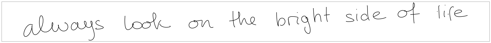
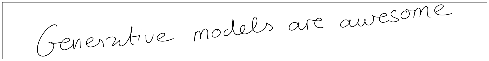

# Handwriting synthesis

Generation of handwriting text with deep neural networks. Reimplementation of the paper https://arxiv.org/abs/1308.0850 
using pytorch.

### Installation

Clone the repository and run `pip3 install .` 

### Model training

You can train your own models running scripts `bin/train_prediction.sh` or `bin/train_synthesis.sh`.
Pretrained models can be found in `pretrained` folder.

### Demonstration notebook

The generation and prediction results can be found in `notebooks/results.ipynb`

### Some training tips

To get attention diagonal much faster it's useful to calculate average fraction of out and in sequence lengths and introduce new multiplication coefficient $\alpha$ for the update of
 attention values (p.26 formula(51) original paper):

